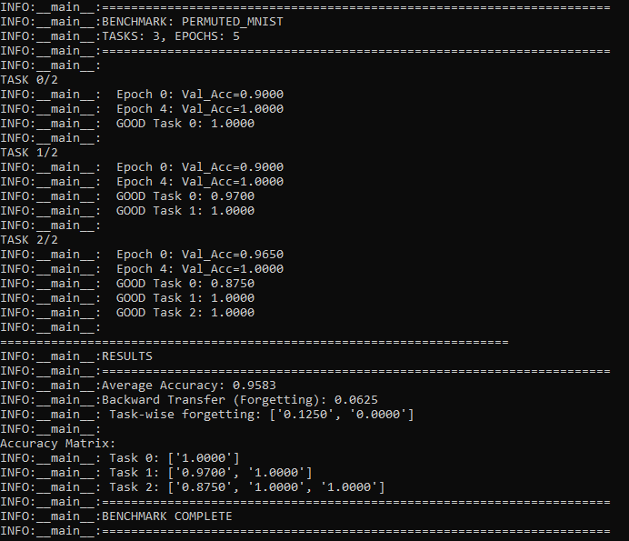

# Baby Dragon Hatchling Continual Learning (BDH-CL)

**Based on**: [pathwaycom/bdh](https://github.com/pathwaycom/bdh)

***

## Introduction

This repository extends the original Baby Dragon Hatchling (BDH) architecture, a biologically inspired large language model bridging transformers and neural computation, by integrating **continual learning** mechanisms inspired by biological synaptic plasticity.

The key contribution of this fork is the implementation of **Adaptive Synaptic Consolidation**, enabling BDH to learn multiple tasks sequentially without catastrophic forgetting, in the spirit of Zenke et al.'s *Continual Learning Through Synaptic Intelligence* (2017).

***

## Highlights of Changes and Improvements

### Continual Learning Integration

- Added **Elastic Weight Consolidation (EWC)** with Fisher information estimation to protect important weights from overwriting during new tasks.
- Implemented **adaptive synaptic gates** that regulate plasticity at the neuron level, inspired by biological metaplasticity.
- Integrated **path integral online importance measures** for efficient tracking of weight significance during training.
- Supported **multi-task sequential training** enabling scalable lifelong learning.

### Benchmarking Suite

- Permuted MNIST



***

## How to Use

- Install dependencies:

  ```bash
  pip install -r requirements.txt
  ```

- Train BDHC with continual learning enabled:

  ```bash
  python train.py --continual_learning
  ```

- Run standard benchmarks:

  ```bash
  python simple_benchmark.py --benchmark permuted_mnist --num_tasks 3 --epochs 5
  ```

***

## Credits

This project builds upon and extends the original [Baby Dragon Hatchling repository by Pathway](https://github.com/pathwaycom/bdh). The original authors' foundational work on biologically inspired neural architectures underpins this extension.

***

## References

- Zenke et al., *Continual Learning Through Synaptic Intelligence*, ICML 2017
- Kosowski et al., *The Dragon Hatchling: The Missing Link between the Transformer and Models of the Brain*, arXiv 2025

***

## Summary

BDH-CL introduces practical, biologically inspired continual learning capabilities into the BDH architecture, enabling robust lifelong learning beyond the single-task limitations of the original. It offers a unique blend of neuroscience theory and state-of-the-art machine learning applied to next-generation language models.

***
